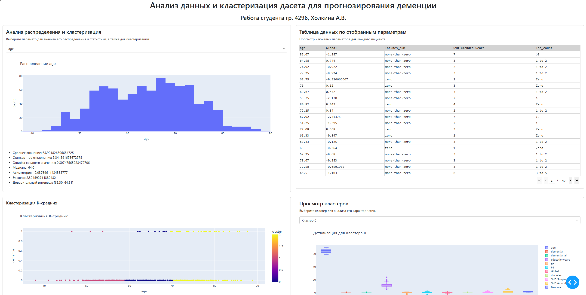

# dashboard
Дашборд с некоторой информацией по анализу датасета для прогнозирования деменции на основе датасета:
https://www.kaggle.com/datasets/fatemehmehrparvar/dementia

Пример работы дашборда:


## Запуск проекта

```bash
poetry install
poetry run python main.py
```
